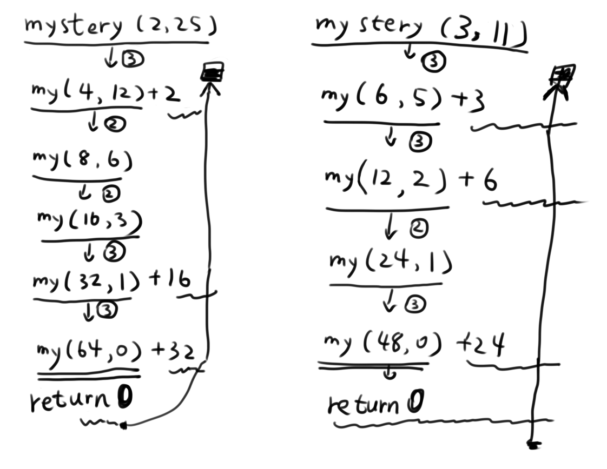

# 练习的解法 #

## 1.1.1 ##
* a.  7
  * 因为是整数除法
* b.  200.0000002
* c.  true
  * && 的优先级最高，||次之，原式化为 false || true，结果是true

## 1.1.2 ##
* a.  double  1.618
* b.  double  10.0
* c.  boolean true
* d.  String  "33"

## 1.1.3 ##
`Foo.java`
```java
class Foo	//类名必须和文件名相同
{
	public static int bar(int a, int b, int c)
	{
		if((a == b)&&(a == c))
		{
			return 0;
		}
		else
		{
			return -1;
		}
	}

	public static void main(String args[])
	{
		//获取3个命令行参数，转换为整数
		//参数不够 会抛出异常
		//传入的不是整数 会抛出异常
		int n1 = Integer.parseInt(args[0]);
		int n2 = Integer.parseInt(args[1]);
		int n3 = Integer.parseInt(args[2]);
		if (bar(n1, n2, n3) == 0)
		{
			System.out.print("equal");
		}
		else{
			System.out.print("not equal");
		}
	}
}
```

## 1.1.4 ##
* a.  then是多余的，java没有这个关键词
* b.  `a > b`必须用圆括号包围
* c.  正确
* d.  `c = 0`后应当加一个`;`

## 1.1.5 ##
`IsBetweenZeroAndOne.java`
```java
class IsBetweenZeroAndOne
{

	public static boolean check(double x, double y)
	{
		return check(x)&&check(y);
	}

	// 重载的函数，检查num是否位于指定范围
	public static boolean check(double num)
	{
		if(num > 0 && num < 1)
			return true;
		else
			return false;
	}

	public static void main(String args[])
	{
		//从命令行接受参数吧
		double n1 = Double.parseDouble(args[0]);
		double n2 = Double.parseDouble(args[1]);
		System.out.print(check(n1, n2));
	}
}
```

## 1.1.6 ##
* 总共会打印16次，i∈[0,15]
* f变成f和g的和
* g变成之前的f
```
0
1
1
2
3
5
8
13
21
34
55
89
144
233
377
620
```
以下代码保存为`WillPrintWhat.java`后编译运行
```java
class WillPrintWhat
{
	public static void main(String[] args)
	{
		int f = 0;
		int g = 1;
		for (int i = 0; i <= 15; i++)
		{
			System.out.println(f);
			f = f + g;
			g = f - g;
		}
	}
}
```

## 1.1.7 ##
* a.  `**存疑**`
* b.  499500
  * 外层循环执行999次，i∈[1,1000)
  * 内层循环执行i次，每次执行时sum自增1，即循环完毕sum自增i
  * 综合上2条，sum=1+2+3+...+998+999
  * sum=(1+999)÷2×999=499500
* c.  9000
  * 外层循环执行9次。i从1开始，步长2i --> `1 2 4 8 16 32 64 128 512` 1024(>1000)。
  * 内层循环执行1000次，每次执行时sum自增1，即循环完毕sum自增1000
  * 综上所述，sum=9*1000=9000

## 1.1.8 ##
* a.  b
* b.  ~~bc~~
	* 经验证，win10下是 `197`
* c.  e
以下代码保存为`WillPrintWhat118.java`后编译运行
```java
class WillPrintWhat118
{
	public static void main(String[] args)
	{
		System.out.println('b');
		System.out.println('b' + 'c');
		System.out.println((char)('a' + 4));
		//额外
		System.out.println('a' + 4);
		System.out.println("a" + 4);
		System.out.println(4 + 'a');
		System.out.println(4 + "a");
	}
}
```java
* **额外**这条的结果是`101`、`a4`、`101`、`4a`
* 单引号（字符）双引号（字符串）有别

## 1.1.9 ##
以下保存为`IntegerToBinaryString.java`后编译运行
```java
class IntegerToBinaryString
{
	public static String IntegerToBinaryString(int num)
	{
		String s = "";
		for (int n = num; n > 0; n /= 2)
		{
			s = (n % 2) + s;
		}
		return s;
	}

	public static void main(String[] args)
	{
		int num = Integer.parseInt(args[0]);
		System.out.println(IntegerToBinaryString(num));
	}
}
```

## 1.1.10 ##  
它没有用new为a[]分配内存。这段代码会产生一个variable a might not have been initialized的错误。
```java
//在第一行下面增加这一行
a = new double[10];
```

## 1.1.11 ##
以下保存为`PrintTwoDimensionalBooleanArray.java`后编译运行，每次的结果不同。
```java
import java.util.Random;

class PrintTwoDimensionalBooleanArray
{
	public static void Print2DBooleanArray(boolean[][] a, int rows, int cols)
	{
		System.out.print("    ");	//先打印4个空格
		//打印第一行，列号
		for (int i = 0; i < cols; i++)
		{
			System.out.printf("%2d", i);	//行号,2宽度
			if (i != cols - 1)	//最后一个行号前，
			{
				System.out.printf("%s", " ");	//以空格分隔
			}
			else
			{
				System.out.println();	//最后一个元素，换行
			}
		}//[!]for

		for (int i = 0; i < rows; i++)
		{
			//打印行号, 宽度3
			System.out.printf("%3d%s", i, " ");

			for (int j = 0; j < cols; j++)
			{
				//true='*', false=' '
				//宽度2，空格分隔
				if (a[i][j])
				{
					System.out.printf("%2s", "*");
				}
				else
				{
					System.out.printf("%2s", " ");
				}
				if (j != cols - 1)
				{
					System.out.printf(" ");
				}
				else
				{
					System.out.println();
				}
			}//for j
		}//for i
	}//Print2DBooleanArray

	public static void main(String[] args)
	{
		// 测试
		//随机
		Random rand = new Random();
		//新建一个布尔数组，随机赋值
		boolean[][] a;
		final int ROWS = 11;
		final int COLS = 22;
		a = new boolean[ROWS][COLS];

		for (int i = 0; i < ROWS; i++)
		{
			for (int j = 0; j < COLS; j++)
			{
				a[i][j] = rand.nextBoolean();
			}
		}

		Print2DBooleanArray(a, ROWS, COLS);
	}//main
}
```

## 1.1.12 ##
* 前面关于数组a的都是幌子，会打印的只有最后的for循环。
```
0
1
2
3
4
5
6
7
8
9

```

## 1.1.13 ##
* 完整程序，保存为`PrintTwoDimensionalArrayTransposition.java`后编译运行
* 假设要交换的数组是整数数组
```java
import java.util.Random;

class PrintTwoDimensionalArrayTransposition
{
	public static void printArrayTransposition(int[][] a, int rows, int cols)
	{
		//先打印列，再打印行
		for (int i = 0; i < cols; i++)
		{
			for (int j = 0; j < rows; j ++)
			{
				System.out.printf("%4d", a[j][i]);
				if (j != rows - 1)
				{
					System.out.print(' ');
				}
				else
				{
					System.out.println();
				}
			}
		}
	}

	public static void printArray(int[][] a, int rows, int cols)
	{
		//顺序打印
		for (int i = 0; i < rows; i++)
		{
			for (int j = 0; j < cols; j ++)
			{
				System.out.printf("%4d", a[i][j]);
				if (j != cols - 1)
				{
					System.out.print(' ');
				}
				else
				{
					System.out.println();
				}
			}
		}
	}

	public static void main(String[] args)
	{
		int max = 99;
		Random rand = new Random();

		int m = 9;
		int n = 14;
		int[][] a = new int[m][n];
		for (int i = 0; i < m; i++)
		{
			for (int j = 0; j < n; j++)
			{
				a[i][j] = rand.nextInt(max);
			}
		}

		System.out.printf("%s", "原数组\n");
		printArray(a, m, n);
		System.out.println();
		System.out.printf("%s", "转置后\n");
		printArrayTransposition(a, m, n);
	}
}
```

## 1.1.14 ##
* 题目的意思是不能直接用Math库算。
* 采用按位右移的方法算出N的二进制形态的位数
* 结果是小于log<sub>2</sub>N的的最大整数。
```java
class NotMoreThanlog2N
{
	public static int lg(int N)
	{
		// 如果N小于0，会返回-1
		int count = 0;
		while (N > 0)
		{
			N >>= 1;
			++count;
		}
		return count - 1;
	}

	public static void main(String[] args)
	{
		int num = Integer.parseInt(args[0]);

		System.out.println(lg(num));
	}
}
```

## 1.1.15 ##
**java的数组有一个length属性，之前的解题不知道它，没有用过。**
```java
import java.util.Random;	//Random.nextInt()
import java.util.Arrays;	//Arrays.sort()

class Histogram
{
	public static int[] histogram(int[] a, int M)
	{
		int[] answer = new int[M];

		for (int i = 0; i < a.length; i++)
		{
			answer[a[i]]++;
		}
		return answer;
	}

	public static void main(String[] args)
	{
		Random rand = new Random();

		int max = 11;
		int[] arr = new int[max];
		for (int i = 0; i < arr.length; i++)
		{
			arr[i] = rand.nextInt(max);
		}

		// sort
		System.out.printf("%s\n", "sorted array");
		Arrays.sort(arr);
		for (int i = 0; i < arr.length; i++)
		{
			System.out.printf("%d ", arr[i]);
		}

		System.out.printf("\n%s\n", "histogram");
		int len = 11;
		int[] test = histogram(arr, len);
		for (int i = 0; i < test.length; i++)
		{
			System.out.printf("%d ", test[i]);
		}
	}
}
```

## 1.1.16 ##
`\"31136112246\"`

## 1.1.17 ##
这段代码中的基础情况永远不会被访问。调用exR2(3)会产生调用exR2(0)、exR2(-3)和exR2(-6)，
循环往复直到发送StackOverFlowError。

## 1.1.18 ##
* 结果是`50`
  * 
  * 改变代码（所有`+`替换为`*`）后，结果是`536870912`
  * 只有`a+a`替换为`a*a`，结果是`65811`
* mystery(3, 11)结果是`33`
  * 因为题目有**歧义**，替换后的不做了。

## 1.1.19 ##
